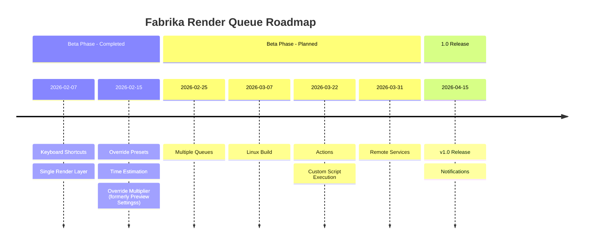

# Project Roadmap

This document outlines the development roadmap for the project.  
_Note: This roadmap is subject to change based on user feedback and development priorities._

## Timeline View

## Detailed Milestones

### Beta Phase

Focused on feature validation, usability testing, and incorporating user feedback to shape the product.

### Remote services

Development and testing of remote monitoring and remote control capabilities.

### Stable release

Final stabilization and polishing in preparation for the v1.0 release, marking the end of the Beta phase.

### Long Term / Research

Features under exploration that do not yet have a committed timeline.

- **MacOS**: The project is already structured to support this platform, but I currently lack the resources to build and test it.
- **Mobile app for remote features**: A nice-to-have addition that will depend on overall project adoption and community support.

## Community Feedback & Roadmap Influence

A dedicated [Discord server](https://discord.gg/K3QkyWeHCu) is available for discussions, feature requests, and feedback.

This space is used to collect feature requests and workflow ideas, user support and general discussions.

If you want to help shape the future of Fabrika Queue, this is the place to do it. [Join our Discord Server](https://discord.gg/K3QkyWeHCu).
